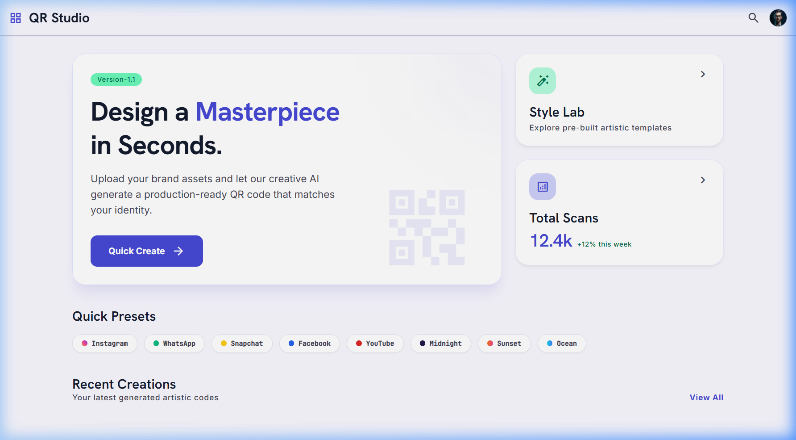
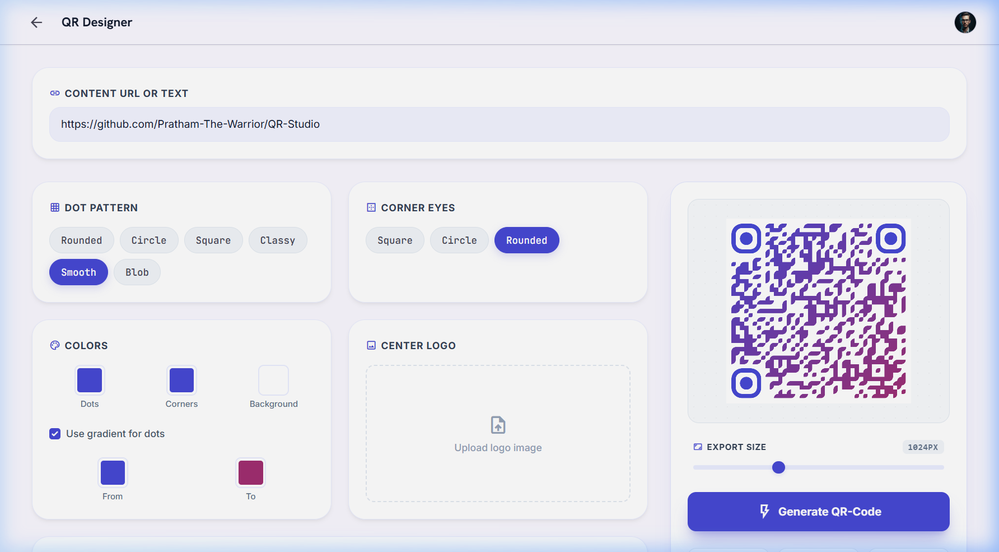

# 🎨 QR Studio — Designer QR Code Generator

QR Studio is a premium, web-based utility for designing and generating highly customized, production-ready QR codes. Crafted with modern design principles (Glassmorphism, custom typography, and fluid responsive grids), it enables creators and brands to align QR codes perfectly with their visual identity in seconds.

---

## 📸 Interface Preview

### 1. Main Dashboard
A sleek control center that offers an overview of scanning statistics, quick access to branded presets, and a direct gateway to the Designer Studio.


### 2. Designer Studio
An interactive workspace featuring live previews, micro-interactions, customizable frame themes, gradient builders, and logo integration.


---

## ✨ Features

- **🌈 High-Fidelity Customization:**
  - **Dot Patterns:** Choose from multiple styles including `Rounded`, `Circle`, `Square`, `Classy`, `Smooth`, and `Blob`.
  - **Corner Eye Shapes:** Customize the outer frames of finder patterns with `Square`, `Circle`, or `Rounded` eyes.
- **🎨 Dynamic Color & Gradient System:**
  - Solid color selection for dots, corner eyes, and background.
  - Linear dot gradients (adjustable direction and multi-stop support).
- **🛡️ Custom Brand Integration:**
  - Center logo upload with automated image scaling, circular masking, and transparency support.
  - Social media and branding presets (`Instagram`, `WhatsApp`, `Snapchat`, `Facebook`, `YouTube`, `Midnight`, `Sunset`, `Ocean`) loaded in a single click.
- **🖼️ Smart Framed Templates:**
  - Standard frame variants: `Classic`, `Minimal`, and `Badge`.
  - Fully editable top/bottom call-to-action text, custom frame colors, and background contrast styling.
- **⚡ Pro Exports:**
  - Slider control for export resolutions ranging from `500px` up to `2000px`.
  - Multi-format support: Download as **PNG**, vector-based **SVG**, or share directly using the native system share menu / copy image to clipboard.
- **📊 Interactive Analytics Dashboard (Mockups):**
  - Live preview of mock scan stats, user agent share (iOS vs. Android), and global location reach bar chart.

---

## 🛠️ Technical Stack & Architecture

- **Core Structure:** HTML5 Semantic elements with Tailwind CSS for rapid modern styling.
- **Typography Engine:** [Google Fonts](https://fonts.google.com/) integrations:
  - *Hanken Grotesk* for sleek, geometric headlines.
  - *Inter* for legible body text.
  - *JetBrains Mono* for metadata, technical tags, and micro-labels.
- **Vector Styling:** Built on top of the robust [qr-code-styling](https://github.com/kozakdenys/qr-code-styling) library.
- **Custom Canvas Composite Engine:** Custom frames (`Classic`, `Minimal`, `Badge`) are drawn using HTML5 Canvas 2D context (`CanvasRenderingContext2D`) by programmatically compounding the vector QR output with custom geometric layouts, labels, and borders before export.
- **Offline Capability:** Pure client-side JavaScript execution with no external backend storage required; preset assets are embedded directly as base64 URIs.

---

## 🚀 Getting Started

No installation or build steps are necessary to run this project locally.

1. **Clone the repository:**
   ```bash
   git clone https://github.com/Pratham-The-Warrior/QR-Studio.git
   cd QR-Studio
   ```
2. **Launch the application:**
   Simply open `index.html` in any modern web browser or run a simple local web server:
   ```bash
   # Using Python
   python -m http.server 8000
   
   # Using Node.js (npx)
   npx serve .
   ```
3. Open `http://localhost:8000` (or the respective port) to view it.

---

## 🧑‍💻 Contributing & Developer Details

- **Preset Declarations:** Theme settings can be found in `script.js` under the `presets` object. Adding a new brand requires declaring `dotsOptions`, `cornersSquareOptions`, `cornersDotOptions`, and optional center logo graphics.
- **Custom Canvas Layouts:** Frame drawing math is detailed within the `drawFrame()` method in `script.js`.
